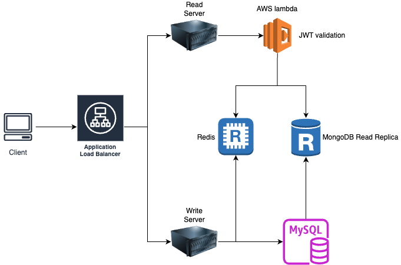

# Scalable Read-Optimized Backend System Design (Redis + Kafka + NoSQL)

A simplified but production-style CQRS backend system demonstrating:
- Read-through caching with **Redis**
- User identity validation via **AWS Lambda**
- Eventual consistency with **cache updates**
- Separation of read and write paths (lightweight **CQRS**)

## Architecture Overview

**Reads**: AWS Lambda validates client identity -> Go to Redis first -> fallback to DB if cache misses

**Writes**: Server updates database & Redis cache

## Technologies Used

- **Redis** - in-memory cache
- **MongoDB** - persistent storage
- **AWS Lambda** - user identity validation
- **Java Servlet** - multi-threaded backend

## How It Works

### Write Request

1. App receives a POST request
2. Load balancer forwards it to write server
3. Write server writes the data to MongoDB
4. Write server writes the message to Redis
6. Redis updates its cache

### Read Request

1. App receives a GET request
2. AWS Lambda validates client identity
3. Load balancer forwards it to read server
4. Read server fetches data from Redis (if exists)
5. If cache misses, read server fetches data from MongoDB
6. Read server writes the result to Redis (read-through caching)

## Why This Design

### Pros
- Fast reads via Redis
- Read-write separation

### Trade-offs
Eventual Consistency:
- Redis may temporarily serve stale data (delay in message queue publishing)
- Potential race condition: cache updated by read-through (GET) and consumer (POST)

## Conclusion

This system follows the AP (Availability + Partition Tolerance) model under the CAP Theorem. It prioritizes availability by continuing to serve read requests from Redis and accept write requests to the database. Redis is updated asynchronously through a message queue and consumer pattern, which means it may temporarily serve stale data, trading off strict consistency in favor of system responsiveness and resilience. 
This design is well-suited for read-heavy applications where eventual consistency is acceptable and high availability is critical.
